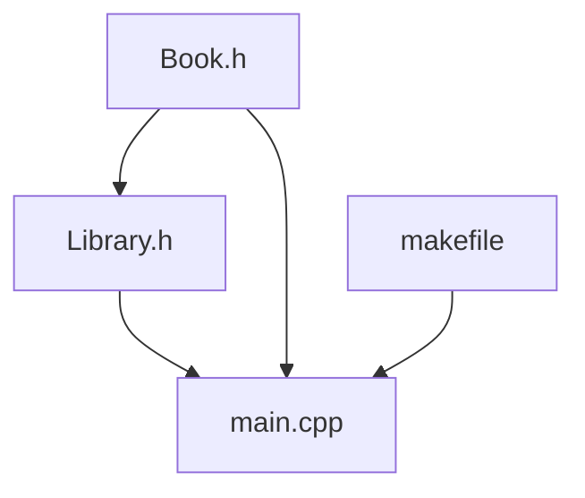

# Library Management System
NYCU 515506 Data Structures and Object-oriented Programming HW2
## Run the program
* To build and run the project
``make``
* To clean the .o file
``make clean``

## Usage
* The UI of this system is like
```zsh
Library Management System
1. Add a new book
2. Search for a book
3. Check out a book
4. Return a book
5. List all books
6. Check borrowed books
7. Exit
Enter your choice:
```
* Choose 1 to add the book in the library
```zsh
Enter your choice: 1
---------------------- Add New Book ---------------------
Enter book title: The C++ Programming Language
Enter author: Bjarne Stroustrup
Enter genre: Programming
Enter overview: A classic C++ reference book.
Enter publication year: 2013
Enter number of copies: 2 
Book added to the library.
```
* Choose 2 to search for a book, we have following method to serach book
  * Search by book's name
  * Search by book's genre
  * Search by book's publication year
* If the book's correspond your command, it will show that book's detail.
```zsh
Enter your choice: 2
--------------------- Search Book ---------------------
1. Search by name
2. Search by genre
3. Search by publication year
Enter your choice: 1
Enter book name: Clean Code

Title: Clean Code
Author: Robert C. Martin
Genre: Software Engineering
Available Copies: 1
Book's Overview: A handbook of agile software craftsmanship.
```
* Choose 3 to borrow the book from library, if that book's copy is larger than 0, than you can borrow it.
```zsh
Library Management System
1. Add a new book
2. Search for a book
3. Check out a book
4. Return a book
5. List all books
6. Check borrowed books
7. Exit
Enter your choice: 3
--------------------- Check Out Book ---------------------
Enter the title of the book to check out: The C++ Programming Language
Book 'The C++ Programming Language' borrowed successfully!
Borrow Date: 6/8/2025
Due date: 6/22/2025
```
* Choose 4 to return the book
  * If that book only have one non-returned book, then return it directly.
  * If there are more than 1 non-returned book have same book name, we can choose which one is returned by the borrow date and due date.
```zsh
Enter your choice: 4
--------------------- Return Book ---------------------
Enter the title of the book to return: The C++ Programming Language
Multiple copies of 'The C++ Programming Language' are borrowed. Please select the copy to return:
1. The C++ Programming Language
Borrowed on: 6/8/2025
Due date: 6/22/2025
2. The C++ Programming Language
Borrowed on: 6/8/2025
Due date: 6/22/2025
Enter the number of the copy to return: 1
Book ' The C++ Programming Language ' returned successfully!
``` 
* Choose 5 to list all the books in the library
```zsh
Enter your choice: 5
--------------------- List All Books ---------------------
Library Books: 

Title: Clean Code
Author: Robert C. Martin
Genre: Software Engineering
Available Copies: 1
Book's Overview: A handbook of agile software craftsmanship.


Title: Python Crash Course
Author: Eric Matthes
Genre: Programming
Available Copies: 0
Book's Overview: A beginner-friendly Python guide.


Title: The C++ Programming Language
Author: Bjarne Stroustrup
Genre: Programming
Available Copies: 1
Book's Overview: A classic C++ reference book.
```
* Choose 6 to list all the non-returned books.
```zsh
Enter your choice: 6
--------------------- Borrowed Books ---------------------
Borrowed Books: 

Title: Python Crash Course
Author: Eric Matthes
Genre: Programming
Available Copies: 0
Book's Overview: A beginner-friendly Python guide.
Borrowed on: 6/8/2025
Due date: 6/22/2025

Title: The C++ Programming Language
Author: Bjarne Stroustrup
Genre: Programming
Available Copies: 1
Book's Overview: A classic C++ reference book.
Borrowed on: 6/8/2025
Due date: 6/22/2025
```
* Choose 7 to exit the Library Management System
```zsh
Enter your choice: 7
Exit library management system. Thank you!!!

```
## Tree diagram
