# Todo list project
## Run the program
* To build and run the project
```zsh
make
```
* To clean the .o file
```zsh
make clean
```
## Usage
  * The UI of this program is following
    
  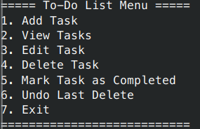

  * Add task(choose 1)
    
  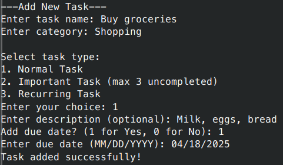

  * View task(choose 2)
    * Choose 1 to show all the noncompleted task.
  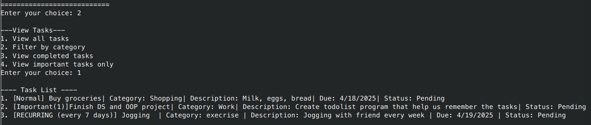
    * Choose 2 can show the task by the specific category
  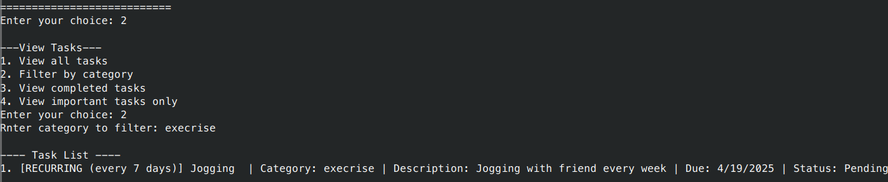
    * Choose 4 to view important task only
  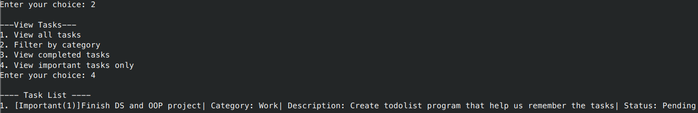

  * Edit task(choose 3)
  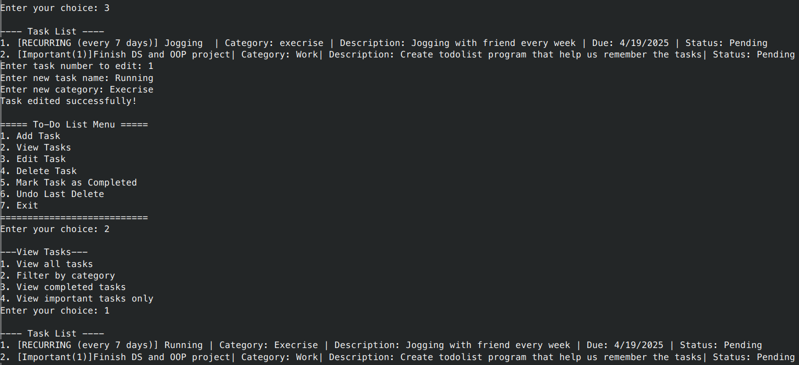

  * Delete task(choose 4)
  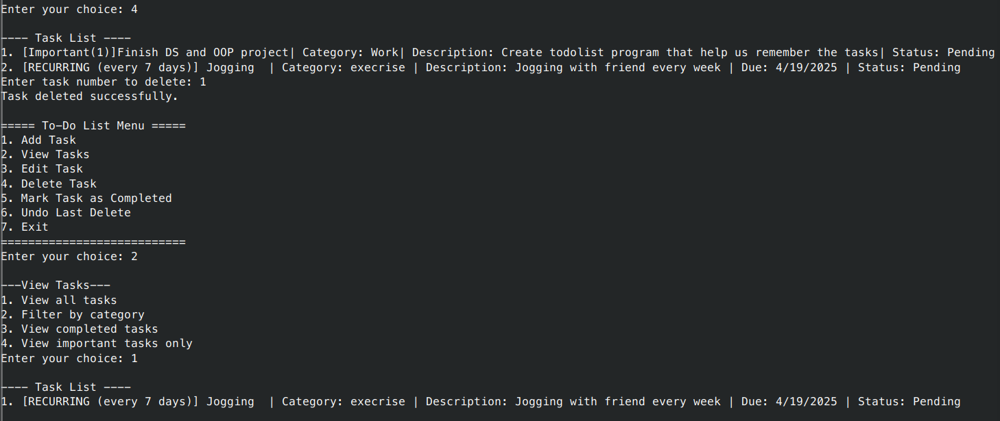

  * Mark task as completed(choose 5)
  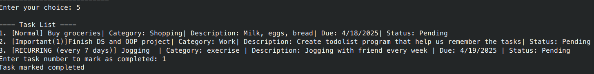
    * If we view task now and view all, we'll find out that we can't find completed task
  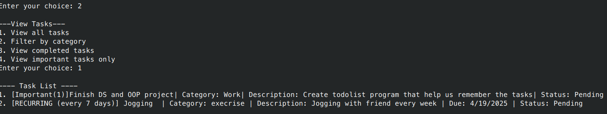
    * In view task, we have to choose 3 to see the completed task
  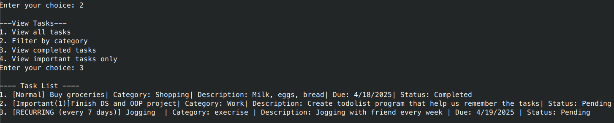

  * Undo the last deleted task(choose 6)
  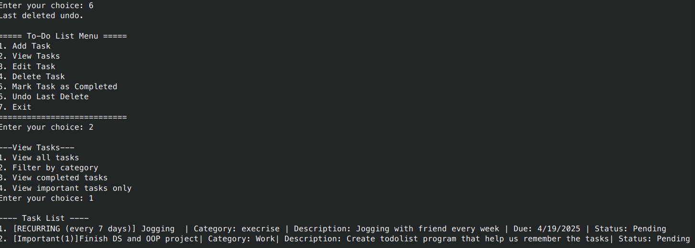

  * Exit(choose 7)

  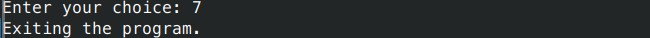
